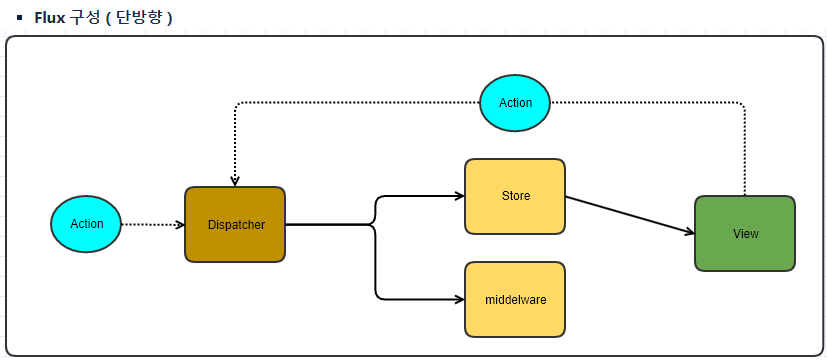
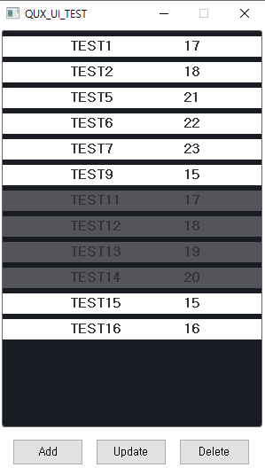

# QUX Library
- 코드의 반복을 줄이고 양방향 연결로 인한 코드 복잡성을 제거하기 위한 라이브러리입니다.
- QT의 Signal/Slot을 이용 Flux모델 구성, Custom Class Property를 사용할 수 있는 PROPETY, Bind 메크로, 
  UI Layout을 지원합니다. 

## Platforms
- Visual Studio 2019
- QT Library (5.15.2)
- QT Visual Studio add-in (https://wiki.qt.io/Visual_Studio_Add-in)

## 빌드 
- 정적 라이브러리 (Qux.lib)
- X64 , X86 지원 

## 솔루션 구성

### QUX
#### 1. Flux
- Store, Middelware, Dispatcher, Action으로 구성
   

#### 2. Model 
- AbstractKeyModel을 기초로 데이터를 관리합니다. 
- Filter, Key, sort 모델등이 있고 AbstractKeyModel을 상속받는다면 Store의 어떠한 종류의 모델도 처리 가능합니다. 

#### 3. ui
- Store의 정보를 보여주는 컨트롤 
- insert / delete / update 모델의 정보에 따라 실시간으로 데이터 표출 
- Widget의 Property와 연결되어 있습니다. 

#### 4. utility
- 자주 사용하는 자료구조 집합

### QUX_TEST
#### UniTest (QUX_Test Project)
- QUX의 주요 클래스와 함수를 테스트 합니다. 
- Async, Bind, Flux, MetaObject, Model, QValue, SignalObject, UI 등을 테스트 합니다. 

### QUX_UI_TEST
#### ListItem Test  
- ListView를 통해 아이템 Add/Delete/Update를 테스트 합니다.
- Add : ListView 아이템 생성
- Update : 모든 아이템의 숫자 +1 증가
- Delete : 드레그 한 리스트 아이템의 정보를 삭제

 

